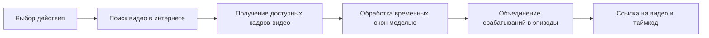

# SocSpot: обучение, оценка и поиск новых видео

## Что уже работает

Есть нарезка, предварительные метки, страница просмотра и экспериментальные списки train/validation/test. Добавлены 108 окон `other` из 40 матчей Hugging Face, с разделением по матчам. Реализованы дообучение R3D-18, оценка test, поиск новых видео YouTube и Python-сервис распознавания со страницей поиска. Команды, файлы результатов и границы API приведены в [инструкции запуска](running.md). Первый эксперимент использует доступный CPU PyTorch; установка CUDA для локальной RTX 3050 Ti с 4 ГБ пока не завершена.

## Обучение и оценка

1. Проверить разметку, включая новое дополнение `other`. Предварительный просмотр HF сделан по кадрам с шагом 0,5 секунды; между кадрами могут оставаться короткие целевые действия. В следующих пополнениях смешивать источники для всех классов, чтобы метка не определялась водяным знаком, FPS или монтажом.
2. Зафиксировать разбиение и проверку повторов. Для пересмотренной разметки v2 созданы манифесты `data/splits/review_v2_source_holdout/`; исходные `initial_source_holdout` сохранены для первого эксперимента. Боковые ножницы входят в `bicycle_kick`. Подробности — в [описании ревизии](annotation-v2.md).
3. Дообучить R3D-18 на train: сначала классификатор, затем `layer4` вместе с классификатором. Реализация — `socspot/train.py`; GPU требует установленной CUDA-сборки PyTorch.
4. По validation выбрать настройки и пороги. Test не использовать для выбора лучшей эпохи, порогов или изменений модели.
5. На test получить precision, recall и F1 для каждого действия, матрицу ошибок и количество примеров. Для поиска в длинном видео дополнительно разметить целые отложенные фрагменты и измерить пропущенные события, ложные срабатывания и ошибки таймкодов. Оценка коротких заранее выбранных клипов сама по себе этого не показывает.

Известные повторы должны оставаться в одной части либо исключаться. Существующий эксперимент отдельно держит тестовые исходники и убирает известные совпадения; аудит всех совпадений и матчей ещё не завершён. Поэтому его будущие метрики нужно обозначать как предварительные.

## Сценарий пользователя

Пользователь выбирает действие. Система сама ищет новые видео и проверяет найденные ролики моделью.

Первый источник — YouTube. По умолчанию используется поиск yt-dlp; при заданном `YOUTUBE_API_KEY` — YouTube Data API `search.list`. Запросы про пасы пяткой и удары через себя дают кандидатов. Затем yt-dlp и FFmpeg получают доступное начало ролика для отдельной проверки моделью. Совпадение названия с запросом не считается подтверждением действия.

FastAPI принимает запрос и возвращает статус фоновой задачи. Python-обработчик читает новые ролики, оценивает временные окна и сохраняет эпизоды: `video_id`, `label`, `start_sec`, `end_sec`, `model_score`, `model_version`. Spring Boot в репозитории пока отсутствует; он может обращаться к готовому HTTP API. Значение `model_score` не является гарантированной вероятностью правильного ответа без отдельной проверки калибровки.

Пользователь получает ссылки с таймкодами и, если доступны, превью. Обработанные ролики и результаты можно кешировать по ID и версии модели. Найденные ролики не добавляются автоматически в обучение: для этого требуется разметка, иначе ошибки модели будут становиться новыми обучающими метками.

Сервис разрешает поиск после появления выбранной модели и тестового отчёта. Блокировки YouTube и ошибки получения видео показываются явно. Объём реально проверенной записи указан в каждой задаче; проверка первых секунд не означает проверку всего видео.

## Первичные источники

- [Разделение данных, validation и группировка зависимых наблюдений — scikit-learn](https://scikit-learn.org/stable/modules/cross_validation.html).
- [Готовая видеомодель R3D-18 и её преобразования входа — Torchvision](https://docs.pytorch.org/vision/stable/models/generated/torchvision.models.video.r3d_18.html).
- [Поиск видео — YouTube Data API](https://developers.google.com/youtube/v3/docs/search/list).
- [Состав результата поиска — YouTube Data API](https://developers.google.com/youtube/v3/docs/search).
